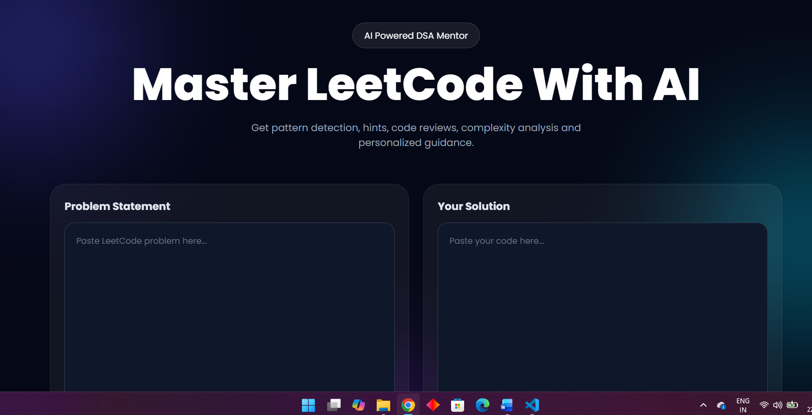
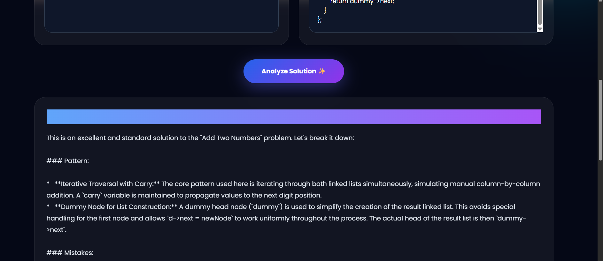

# 🤖 Agentic LeetCode Assistant

An AI-powered coding assistant built with React, FastAPI, and Large Language Models (LLMs) to help users solve LeetCode problems efficiently. The application generates optimized solutions, explains approaches, analyzes time and space complexity, and provides an interactive coding experience.

## 🚀 Features

* AI-powered LeetCode problem solving
* Optimized code generation
* Step-by-step solution explanations
* Time and Space Complexity Analysis
* Interactive chat-based interface
* FastAPI backend with API integration
* Responsive React frontend

## 🛠️ Tech Stack

### Frontend

* React.js
* JavaScript
* HTML5
* CSS3

### Backend

* FastAPI
* Python
* Uvicorn

### AI & APIs

* OpenAI API / LLM Integration
* REST APIs

## 📂 Project Structure

```text
agentic-leetcode-assistant/
│
├── client/
│   ├── src/
│   ├── public/
│   └── package.json
│
├── server/
│   ├── app.py
│   ├── requirements.txt
│   └── .env
│
├── screenshots/
│   ├── h1.png
│   └── h2.png
│
├── README.md
├── .gitignore
└── LICENSE
```

## 📸 Screenshots

### Home Interface



### AI Solution Generation



## ⚙️ Installation

### Clone the Repository

```bash
git clone https://github.com/ishannndot/agentic-leetcode-assistant.git
cd agentic-leetcode-assistant
```

### Frontend Setup

```bash
cd client
npm install
npm run dev
```

### Backend Setup

```bash
cd server

python -m venv .venv

# Windows
.venv\Scripts\activate

pip install -r requirements.txt
uvicorn app:app --reload
```

## 🔑 Environment Variables

Create a `.env` file inside the server folder:

```env
OPENAI_API_KEY=your_api_key_here
```

## ▶️ Usage

1. Start the FastAPI backend.
2. Start the React frontend.
3. Open the application in your browser.
4. Enter a LeetCode problem statement.
5. Receive:

   * Optimized solution
   * Detailed explanation
   * Time complexity analysis
   * Space complexity analysis

## 🎯 Future Enhancements

* Multi-language code generation
* Code execution support
* Contest problem analysis
* Personalized learning recommendations
* Voice-enabled coding assistant

## 👨‍💻 Author

**Ishan Srivastava**

* B.Tech CSE (AI & ML)
* LeetCode & Competitive Programming Enthusiast
* Full Stack & AI Developer
